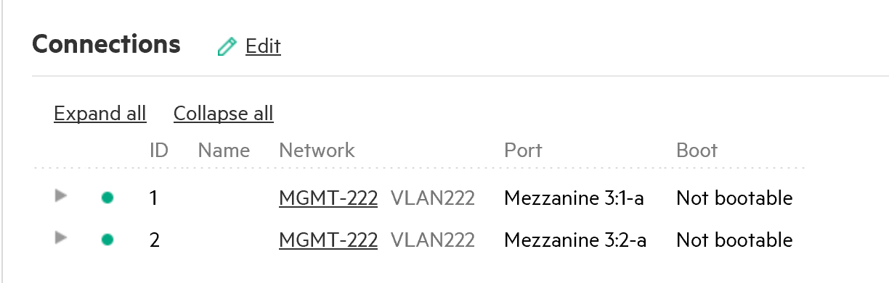
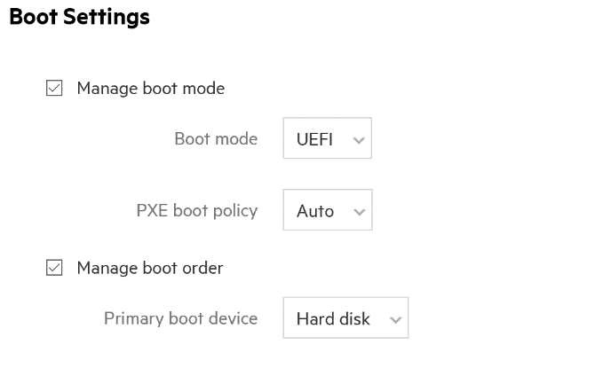
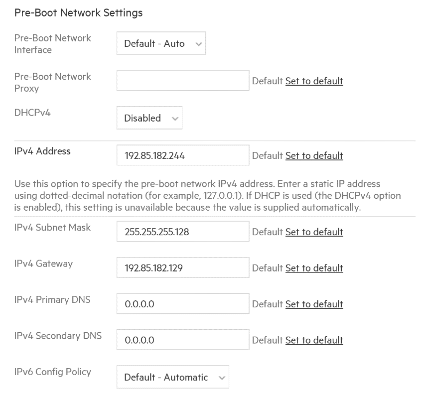
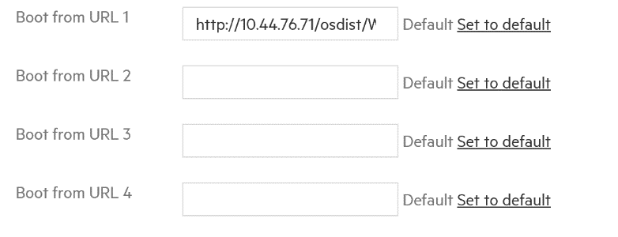
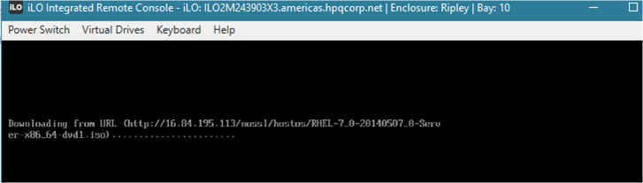
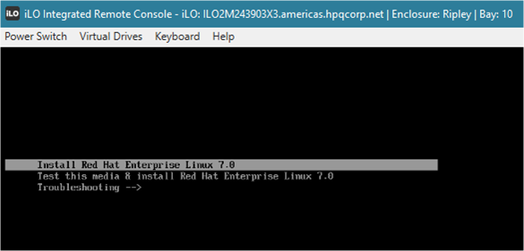

>   Infrastructure Automation with Operating System Deployment

>   How To Guide for Gen9 and Gen10 UEFI HTTP Boot and iLO Virtual Media with the Composable API

Introduction
============

With Insight Control Server Provisioning (ICSP) ceasing to support Gen10 and newer, this whitepaper and accompanying GitHub repository, is meant to assist customers and partners with alternate methods for deploying supported operating systems.  This whitepaper is not meant to provide guidance on the exact steps on deploying an operating system, but rather on how to boot strap a server into an automation environment or scripted OS install.  There are two options, each with different implementations.  Each section describes the requirements, and process to booting a server into either a maintenance OS, or OS installation.

UEFI HTTP Boot with Gen9 and Gen10
==================================

UEFI HTTP Boot[^1] is a feature introduced into UEFI 2.5 spec that its goal is
to help OS vendors and Enterprises to replace, or provide an alternative to, PXE
in the datacenter. As most customers know, PXE is viewed as either a security
risk or does not scale well (TFTP timeouts, multicast issues, etc.). UEFI HTTP
Boot aims to address this by utilizing current and more reliable technologies;
HTTP/HTTPS (security and load balancing) and TCP (more reliable than UDP).

[^1]: *Firmware in the datacenter: Goodbye PXE and IPMI. Welcome HTTP Boot and
Redfish*:
<http://www.uefi.org/sites/default/files/resources/UEFI_Plugfest_May_2015_HTTP_Boot_Redfish_Samer_El-Haj_ver1.2.pdf>

However, not all Operating Systems support this method. The following table
shows what OS installers or mini-init environments are supported. The table will
be updated over time as newer Operating Systems that support UEFI HTTP Boot are
released and known.

Table 1. UEFI HTTP Boot for OS Installation

| OS Vendor                           | Version        |
|-------------------------------------|----------------|
| SuSE Linux Enterprise Server (SLES) | 12 SP2         |
| WinPE                               | 5.0 or greater |

When other OS vendors add support for UEFI HTTP Boot, we will update this
document. If you are planning on using Red Hat Enterprise Linux (RHEL), Windows
Server, VMware vSphere, SLES 12 or older, or any other HPE Tier 1 supported
OS[^2], please skip this section and go to the Gen9 and Gen10 Virtual Media
Mount section.

[^2]: HPE Servers Support & Certification Matrices:
<http://h17007.www1.hpe.com/us/en/enterprise/servers/supportmatrix/windows.aspx#.WZSAiZ9Fyxx>

The following table outlines the basic requirements in order to utilize UEFI
HTTP Boot.

Table 2. Infrastructure requirements for UEFI HTTP Boot

| Prerequisits             |                                                          |
|--------------------------|----------------------------------------------------------|
| Web Server               | HTTP or HTTPS, anonymous authentication                  |
| HTTP/HTTPS Loadbalancing | Optional. Can help with HTTP/HTTPS connection balancing. |
| IPv4 Addressing          | Static or DHCP                                           |
| IPv6 Addressing          | Automatic (can utilize SLAAC or DHCPv6) or Static        |

When definining a Server Profile it is important that for BL and SY enviornments
with Virtual Connect, 1 or more Connections must be assigned that have access to
the web server hosting the ISO images.

Figure 1. Connections within Server Profile that provide L2 connectivity to web
server.

The System ROM Boot Mode (aka BIOS Boot Mode) must be set to UEFI.

Figure 2. System ROM boot mode setting.

Finally, UEFI Boot must be configured within the Server Profile BIOS Settings;
Boot Options -\> Pre-Boot Network Settings. By default DHCPv4 setting is set to
Default – Enabled, and IPv6 Config Policy is set to Default - Automatic. Change
the DHCPv4 setting to Disabled in order to set a Static IPv4 Address, Subnet
Mask, Default Gateway and/or DNS.

Figure 3. Pre-boot Network Settings for IPv4 Static Address assignment in Server
Profile.

Figure 4. Pre-boot Network Settings for UEFI HTTP Boot URLs.

Figure 5. BL460 Gen9 booting RHEL 7 install ISO via UEFI HTTP Boot.

Figure 6. BL460 Gen9 RHEL 7 installation menu.

iLO Virtual Media Boot with Gen9 and Gen10
==========================================

As discussed in the previous section, not all HPE supported Tier 1 Operating
Systems support UEFI HTTP Boot in order to install an Operating System. Using
Virtual Media would be a more ubiquitous capability, and supports are larger
range of operating systems, as the provided CD/DVD ISO image is directly mounted
to the server.

**Important**

> Scripting iLO Virtual Media will require the iLO Advanced license. Any HPE
> OneView Advanced customer will have an iLO Advanced license installed on their
> iLO.

Using iLO Virtual Media to provision an OS along with the HPE OneView Server
Profile will require a multi-step process. The follow flow chart shows the order
of operation.

`Create Server Profile` --> `Wait for Create Async Task` --> `Generate iLO SSO auth token` --> `Mount virtual media`

Create your Server Profile. 
----------------------------

Server Profiles can be created from a Server Profile Template, with compliance
tracking, or new with unique parameters not associated with Server Profile
Templates. The following options are available to create a Server Profile
resource.

Table 3. Create Server Profile resources

| Language   | Resource Name                                                                                                                 |
|------------|-------------------------------------------------------------------------------------------------------------------------------|
| PowerShell | [New-HPOVServerProfile](https://github.com/HewlettPackard/POSH-HPOneView/wiki/New-HPOVServerProfile)                          |
|            | [Wait-HPOVTaskComplete](https://github.com/HewlettPackard/POSH-HPOneView/wiki/Wait-HPOVTaskComplete)                          |
| Python     | [Server-profile.py](https://github.com/HewlettPackard/python-hpOneView/blob/master/examples/server_profiles.py)               |
| Ruby       | [server_profile.rb](https://github.com/HewlettPackard/oneview-sdk-ruby/blob/master/examples/shared_samples/server_profile.rb) |

Obtain an iLO Single-Sign On (SSO) auth token from the HPE OneView API
----------------------------------------------------------------------

Next, an iLO SSO auth token needs to be created. The following resources provide
methods to generating either an iLO RedFish session object, or the SSO auth
token to be provided into the appropriate RedFish SDK.

Table 4. Create iLO RedFish SSO token resources

| Language   | Resource Name                                                                          |
|------------|----------------------------------------------------------------------------------------|
| PowerShell | [Get-HPOVIloSso](https://github.com/HewlettPackard/POSH-HPOneView/wiki/Get-HPOVIloSso) |
| Python     | get_ssosessionobject.py                                                                |
| Ruby       | get_ssosessionobject.rb                                                                |

Attach to the iLO REST API (Gen8) or RedFish interface (Gen9 and newer), using the token and set the iLO Virtual Media DVD mount path
-------------------------------------------------------------------------------------------------------------------------------------

Once the iLO RedFish token has been created, the remote ISO needs to be mounted
with iLO Virtual Media. The server/compute node should be instructed to boot
from the mounted ISO image upon next boot, using the One Time Boot (OTB) method
provided by the iLO. The provided scripts will mount the ISO image using the
provided relative URL, and then set the OTB value to “CD”.

**Important**

> Scripting iLO Virtual Media will require the iLO Advanced license. Any HPE
> OneView Advanced customer will have an iLO Advanced license installed on their
> iLO.

Table 5. Mount remote iLO Virtual Media with RedFish resources

| Language   | Resource Name          |
|------------|------------------------|
| PowerShell | Mount-VirtualMedia.ps1 |
| Python     | mount_virtualmedia.py  |
| Ruby       | mount_virtualmedia.rb  |

Optional: Attach to the iLO REST API (Gen8) or RedFish interface (Gen9 and newer), using the token and unmount ISO
------------------------------------------------------------------------------------------------------------------

In typical installations, mounted ISO images, or the DVD/CD drive is
autoejected. For those times where a DVD/CD drive eject command cannot be
initiated from the automation environment or OS installer, the following scripts
will provide the method of unmounting the iLO Virtual Media.

Table 6. Unmount iLO Virtual Media resources

| Language   | Resource Name            |
|------------|--------------------------|
| PowerShell | Unmount-VirtualMedia.ps1 |
| Python     | unmount_virtualmedia.py  |
| Ruby       | unmount_virtualmedia.rb  |

### Resources, contacts, or additional links

Hewlett-Packard GitHub Organization  
[github.com/HewlettPackard](http://github.com/HewlettPackard)

Hewlett-Packard HPE OneView Python SDK  
[github.com/HewlettPackard/python-hpOneView](https://github.com/HewlettPackard/python-hpOneView)

Hewlett-Packard RedFish Python SDK  
github.com/HewlettPackard/python-ilorest-library

Hewlett-Packard HPE OneView Ruby SDK  
[github.com/HewlettPackard/oneview-sdk-ruby](https://github.com/HewlettPackard/oneview-sdk-ruby)

Hewlett-Packard RedFish Ruby SDK  
[github.com/HewlettPackard/ilo-sdk-ruby](https://github.com/HewlettPackard/ilo-sdk-ruby)

Hewlett-Packard HPE OneView PowerShell Library  
[powershellgallery.com/packages/HPOneView.310](https://powershellgallery.com/packages/HPOneView.310)

Hewlett-Packard RedFish PowerShell Library  
[powershellgallery.com/packages/HPRESTCmdlets](https://www.powershellgallery.com/packages/HPRESTCmdlets/)

Learn more at
-------------

hpe.com/info/oneview
--------------------
